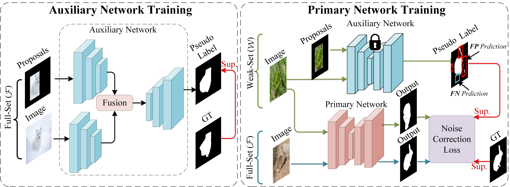
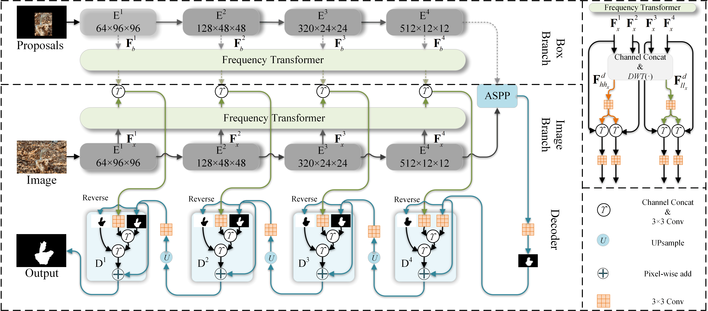
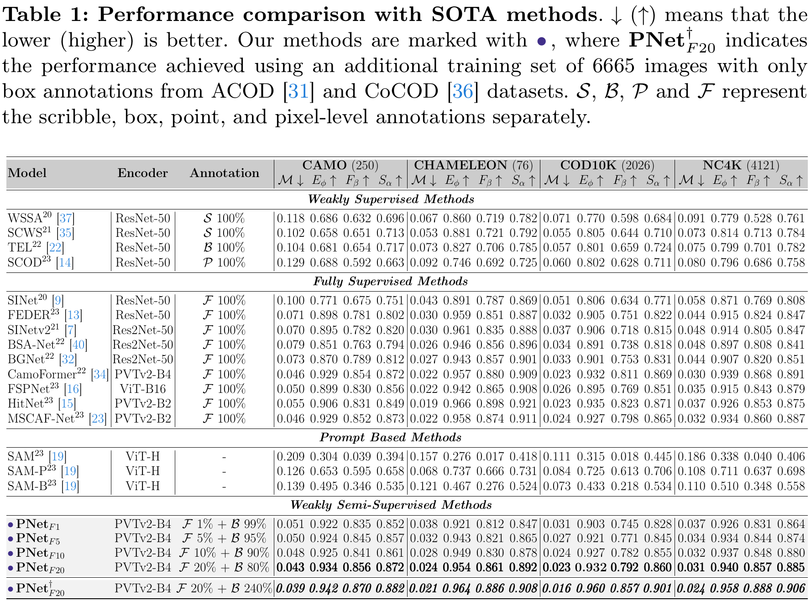
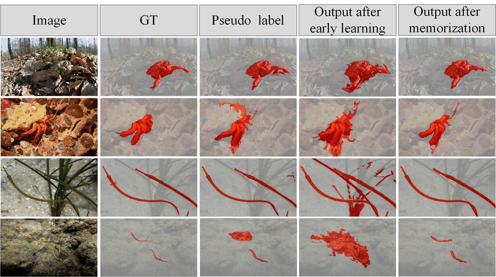
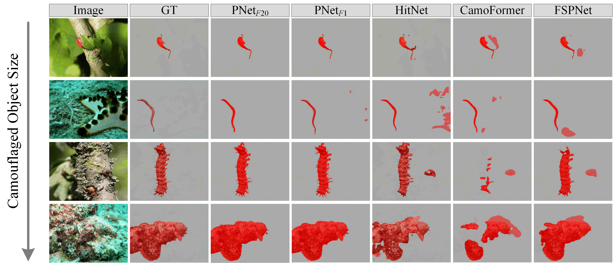

# Learning Camouflage Object Detection from Noisy Pseudo Label

This is the open source repository for our paper **Learning Camouflaged Object Detection from Noisy Pseudo Label**, which is accepted by ECCV2024!!!. 

## **Framework Architecture**

## **Performance**

